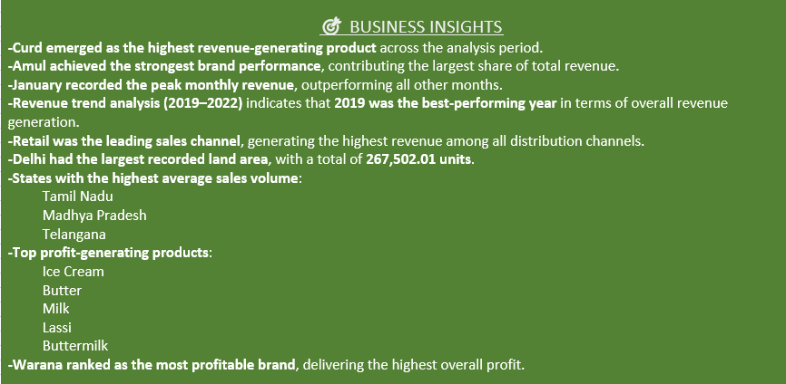

# 🐄 Dairy Farm SQL Analytics Project

## 📌 About the Project

The Dairy Farm SQL Analytics Project is a data analysis solution built using SQL to explore sales performance, revenue generation, inventory management, and customer purchasing behavior within a dairy business environment.

This project demonstrates how SQL can be leveraged to transform raw business data into actionable insights that support informed decision-making. It was developed as a hands-on learning project to strengthen practical SQL skills while solving real-world business problems.

The analysis focuses on identifying trends, monitoring operational performance, and uncovering opportunities for business improvement through data-driven reporting.

---

## 🎯 Project Goals

* Evaluate dairy product sales performance.
* Analyze revenue trends across products and sales channels.
* Understand customer purchasing patterns and demand behavior.
* Monitor inventory levels and stock management.
* Generate actionable business insights from data.
* Apply advanced SQL techniques in a practical business scenario.

---

## 🚀 Project Highlights

* Interactive SQL reporting and analysis.
* Product sales and revenue performance tracking.
* Customer and supplier data analysis.
* Inventory monitoring and stock evaluation.
* Profitability and expense assessment.
* Relational database design and management.
* Advanced SQL query development and optimization.

---

## 📊 Analytical Reports Included

### Revenue & Sales Insights

* Product-wise revenue analysis.
* Identification of the top-performing brand by revenue.
* Monthly revenue trend analysis.
* Sales channel performance evaluation.
* Selling price versus listed price comparison.

### Inventory Insights

* Detection of products below minimum stock levels.
* Product-wise quantity requirement analysis.

### Customer Insights

* Top customer locations based on purchase activity.

---

## 🛠️ Tools & Technologies

* SQL
* MySQL / SQL Server

---

## 📈 SQL Techniques Applied

* Data Retrieval using SELECT Statements
* Table Relationships using JOINs
* Data Aggregation with GROUP BY
* Result Sorting using ORDER BY
* Aggregate Functions (SUM, AVG, COUNT, MAX, MIN)
* Conditional Logic with CASE Statements
* Nested Queries and Subqueries
* Advanced Analytics using Window Functions

---


## SQL Analysis & Queries

## Q1: Total revenue generated by each product
```sql
select Product_Name, round(sum(Approx_Total_RevenueINR),2) as Revenue  from dairy_dataset
 group by Product_Name 
order by revenue desc;
```

## Q2: Brand with the highest total revenue
```sql
select Brand,  round(sum(Approx_Total_RevenueINR),2) as Revenue from dairy_dataset 
group by Brand
 order by Revenue desc limit 1;
```

## Q3: Monthly revenue trend across all product
```sql
select monthname(Date_),  round(sum(Approx_Total_RevenueINR),2) as Revenue from dairy_dataset group by monthname(Date_) 
order by monthname(Date_) desc;
```

## Q4: Products below the min stock threshold
```sql
select Product_Name, Quantity_in_Stock_liters, Minimum_Stock_Threshold_liters  from dairy_dataset where Minimum_Stock_Threshold_liters > Quantity_in_Stock_liters;```

## Q5: Total recorded qty required per product
```sql
select Product_Name,Quantity_in_Stock_liters,Reorder_Quantity_liters from dairy_dataset where Reorder_Quantity_liters>Quantity_in_Stock_liters;```

## Q6: Which sales channel generated the most revenue
```sql
select Sales_Channel, round(sum(Approx_Total_RevenueINR),2) from dairy_dataset
 group by Sales_Channel;

```

## Q7: Top 5 customers location by purchases
```sql
select Customer_Location, sum(Quantity_Sold_liters) as purchase_volume from dairy_dataset 
group by Customer_Location
 order by purchase_volume desc limit 5;```

## Q8: Avg selling price per product
```sql
select Product_Name, round(avg(Price_per_Unit_sold),2) as average from dairy_dataset
 group by Product_Name 
order by average desc;
```

## Q9: Compare selling price with listed price 
```sql
select Product_Name, Price_per_Unit, Price_per_Unit_sold, round(Price_per_Unit-Price_per_Unit_sold) from dairy_dataset;
```


## Q10: Products with less than 10 days shelf life remaining
```sql
select Product_Name, Shelf_Life_days from dairy_dataset where Shelf_Life_days<10;
```

## Q11: Avg shelf life by product category
```sql
select Brand, avg(Shelf_Life_days) as Average_shelf_life from dairy_dataset
 group by Brand 
order by Average_shelf_life desc ;```

## Q12: Avg no. of cows per farm size category
```sql
select Farm_Size, avg(Number_of_Cows) from dairy_dataset 
group by Farm_Size;

```

## Q13: Location with the largest total land area
```sql
select Location, sum(Total_Land_area_acres) from dairy_dataset 
group by Location
 order by sum(Total_Land_area_acres) desc;
```

## Q14: Top 3 location by average production qty
```sql
select Location, round(avg(Quantity_liters),2) as average_prod_quantity from dairy_dataset 
group by Location
 order by average_prod_quantity desc limit 3;
```

## Q15: Calculate profit for each product
```sql
select Product_Name, round(Price_per_Unit-Price_per_Unit_sold,2) as profit from dairy_dataset ;

```

## Q16:  Most profitable brand overall
```sql
select Brand, round(Price_per_Unit_sold-Price_per_Unit) as profit from dairy_dataset
 order by profit desc limit 1;
```

## Q17: Yearly revenue growth
```sql
select year(Date_), round(sum(Approx_Total_RevenueINR),2) as yearly_revenue_growth from dairy_dataset
 group by year(Date_) 
order by yearly_revenue_growth desc ;
```

## Q18: Best selling product each yr
```sql
select Product_Name, year(Date_), sum(Quantity_Sold_liters) from dairy_dataset 
group by  Product_Name, year(Date_);
```

## Q19: Products that need immediate restock
```sql
select Product_Name, Quantity_in_Stock_liters, Minimum_Stock_Threshold_liters  from dairy_dataset where Minimum_Stock_Threshold_liters > Quantity_in_Stock_liters;
```

## Q20: Identify expired products still in stock
```sql
select Product_Name, Quantity_in_Stock_liters, Date_, Expiration_Date from dairy_dataset where Date_>Expiration_Date ;
```

## Q21: Average shelf life per brand
```sql
select Brand, avg(Shelf_Life_days) from dairy_dataset 
group by Brand;


## Q22: Most popular product in each customer location
```sql
select Product_Name, Customer_Location, count(Quantity_Sold_liters) from dairy_dataset
 group by Customer_Location, Product_Name;
```
 


## 📚 Skills Gained

* SQL Query Development
* Query Optimization Techniques
* Data Analysis and Interpretation
* Business Intelligence Reporting
* Dashboard-Oriented Data Preparation
* Data-Driven Problem Solving
* Reporting and Visualization Support


📈 Analysis



